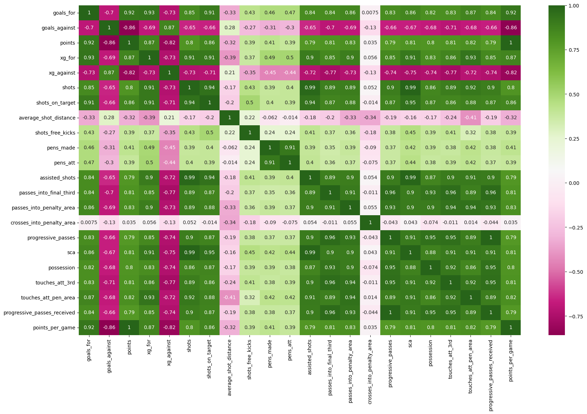
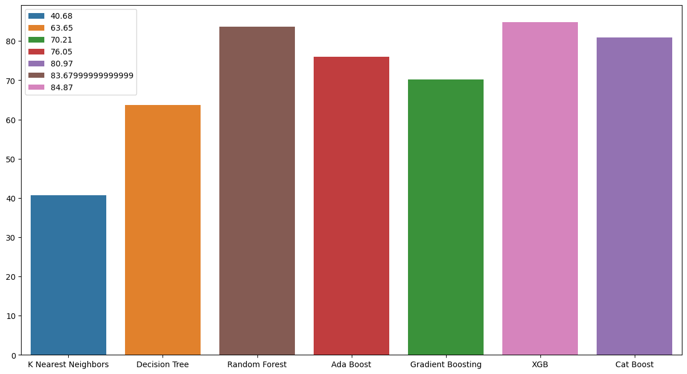
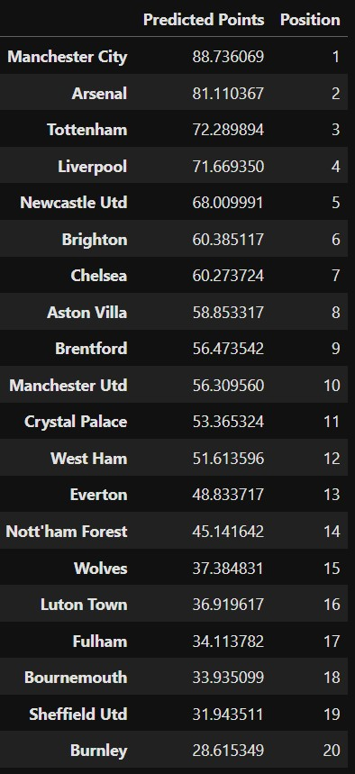

# English Premier League Predictor

## Overview
This project is an English Premier League (EPL) season predictor that utilizes various regression algorithms to forecast the outcomes of the current EPL season. By implementing machine learning models, this tool aims to provide insights into team performance and potential standings in the league.

## Models Used
The following regression algorithms were used in this project:

KNeighborsRegressor

DecisionTreeRegressor

RandomForestRegressor

AdaBoostRegressor

GradientBoostingRegressor

XGBRegressor

CatBoostRegressor

Each of these models was trained and evaluated to provide predictions for the EPL season.

## Feature Heatmap

## Model Comparison

## Result

As we can see, Manchester City come out on top in all the predictions. Bournemouth, Sheffiled United, and Burnley are predicted to get relegated by all the regressors. The rest of the table has some interesting and differentiating outcomes based on the regressor used. While CatBoost predicts Arsenal to finish second at the end of the season, both RandomForest and XGBoost regressors predict them to finish outside the UCL qualification bracket (top 4). Liverpool and Tottenham Hotspur are predicted to finish inside the top 4 in all the predictions. Sadly for Manchester United fans, their current performances indicate a predicted finish of outside the top 10.

## Data Source

The data for this project was collected from the popular sports statistics source: [FBRef](https://fbref.com/en/comps/9/Premier-League-Stats)

 
[Github Link](https://github.com/SankalpMehani/premier_league_predictor)
